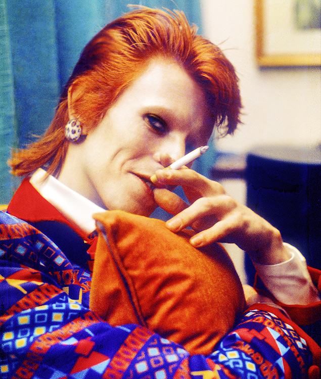

---
output:
  md_document:
    variant: markdown_github
---

<!-- README.md is generated from README.Rmd. Please edit that file -->

```{r, echo = FALSE}
knitr::opts_chunk$set(
  collapse = TRUE,
  comment = "#>",
  fig.path = "README-"
)
```

Esse simples pacote tem o intúito de criar paleta de cores a partir de imagens. Ele utiliza uma clusterização por meio do método k-means para separar os pixels da imagens em grupos de cores.

## Funcionamento

O funcionamento do pacote é muito simples. Ele possui apenas duas funções:

- `criar_paleta`: recebe o caminho de uma imagem e o número de cores desejadas e retorna a paleta de cores.
- `exibir`: exibe a paleta de cores criada


## Exemplos



```{r, fig.width=7, fig.height=2}
library(magrittr)
library(paletaCores)
paleta <- criar_paleta("inst/david bowie.jpeg")
exibir(paleta)
```
